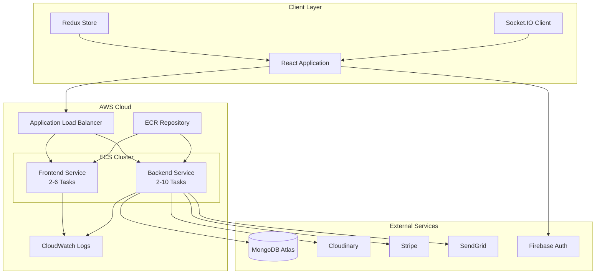
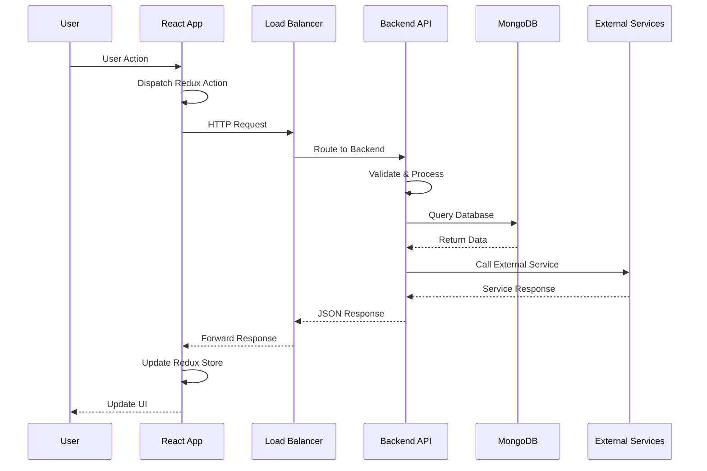
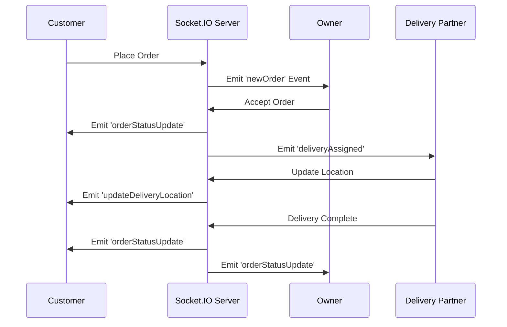
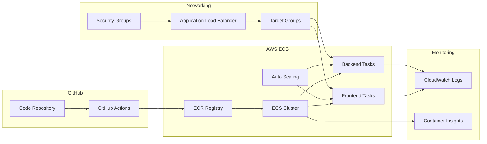

# BiteDash - Food Delivery Platform

A production-ready full-stack food delivery application with real-time order tracking, payment integration, and geospatial delivery assignment. Built with React, Node.js, MongoDB, and Socket.IO.

**Live Application**: http://bitedash-alb-443240071.us-east-1.elb.amazonaws.com/

---

## Overview

BiteDash is a complete food delivery platform connecting customers, restaurant owners, and delivery partners. The application handles the entire order lifecycle from browsing restaurants to delivery confirmation with OTP verification.

### Core Features

**Customer**
- Browse restaurants by city and category
- Real-time order tracking with live delivery partner location
- Payment via Stripe or Cash on Delivery
- Order history and rating system

**Restaurant Owner**
- Menu management with image uploads
- Real-time order notifications
- Order acceptance/rejection workflow
- Earnings and analytics dashboard

**Delivery Partner**
- Geospatial order assignment within 10km radius
- Live navigation between pickup and delivery
- OTP-based delivery verification
- Earnings tracker with breakdown

---

## Technology Stack

### Frontend
- React 19 with Redux Toolkit for state management
- TailwindCSS for styling
- Socket.IO Client for real-time updates
- React Router 7 for routing
- Leaflet for interactive maps
- Vite as build tool

### Backend
- Node.js 20 with Express 5
- MongoDB with Mongoose ODM
- Socket.IO for real-time communication
- JWT authentication with httpOnly cookies
- Bcrypt for password hashing
- Cluster mode for multi-core utilization

### Infrastructure
- AWS ECS Fargate for container orchestration
- AWS ECR for container registry
- Application Load Balancer for traffic distribution
- MongoDB Atlas for database
- Cloudinary for image storage
- GitHub Actions for CI/CD

### External Services
- Stripe for payment processing
- SendGrid for transactional emails
- Firebase for Google OAuth
- Geoapify for geocoding

---

## Architecture

### System Architecture



### Request Flow



### Real-time Communication



### AWS Infrastructure



---

## Project Structure

```
BiteDash/
├── backend/
│   ├── config/
│   │   ├── db.js                    # MongoDB connection
│   │   ├── cache.js                 # In-memory cache
│   │   └── stripe.js                # Stripe configuration
│   ├── controllers/
│   │   ├── auth.controllers.js      # Authentication logic
│   │   ├── order.controllers.js     # Order management
│   │   ├── shop.controllers.js      # Restaurant operations
│   │   ├── item.controllers.js      # Menu item operations
│   │   └── user.controllers.js      # User management
│   ├── middlewares/
│   │   ├── auth.middleware.js       # JWT verification
│   │   ├── rateLimit.middleware.js  # Rate limiting
│   │   ├── security.middleware.js   # Security headers
│   │   └── upload.middleware.js     # File upload handling
│   ├── models/
│   │   ├── user.model.js            # User schema
│   │   ├── shop.model.js            # Restaurant schema
│   │   ├── item.model.js            # Menu item schema
│   │   ├── order.model.js           # Order schema
│   │   └── deliveryAssignment.model.js
│   ├── routes/                      # API endpoints
│   ├── services/                    # Business logic
│   ├── utils/                       # Helper functions
│   ├── validators/                  # Input validation
│   ├── cluster.js                   # Cluster mode setup
│   ├── socket.js                    # Socket.IO configuration
│   ├── Dockerfile                   # Container configuration
│   └── index.js                     # Application entry point
│
├── frontend/
│   ├── src/
│   │   ├── components/              # Reusable UI components
│   │   ├── pages/                   # Route components
│   │   ├── redux/
│   │   │   ├── userSlice.js         # User state
│   │   │   ├── ownerSlice.js        # Owner state
│   │   │   └── mapSlice.js          # Map state
│   │   ├── hooks/                   # Custom React hooks
│   │   ├── constants/               # Application constants
│   │   ├── firebase.js              # Firebase configuration
│   │   └── App.jsx                  # Root component
│   ├── Dockerfile                   # Container configuration
│   ├── nginx.conf                   # Nginx configuration
│   └── vite.config.js               # Build configuration
│
├── .github/
│   └── workflows/
│       ├── deploy-backend.yml       # Backend CI/CD
│       └── deploy-frontend.yml      # Frontend CI/CD
│
└── docker-compose.yml               # Local development setup
```

---

## Installation

### Prerequisites
- Node.js v18 or higher
- MongoDB Atlas account
- AWS account (for deployment)
- npm or yarn

### Local Development Setup

1. Clone the repository
```bash
git clone https://github.com/adarsh-priydarshi-5646/BiteDash-Premium-Food-Delivery-Platform.git
cd BiteDash-Premium-Food-Delivery-Platform
```

2. Backend setup
```bash
cd backend
npm install
cp .env.example .env
```

Configure `backend/.env`:
```env
PORT=8000
NODE_ENV=development
MONGODB_URL=your_mongodb_connection_string
JWT_SECRET=your_jwt_secret
STRIPE_SECRET_KEY=your_stripe_secret_key
CLOUDINARY_CLOUD_NAME=your_cloudinary_name
CLOUDINARY_API_KEY=your_cloudinary_api_key
CLOUDINARY_API_SECRET=your_cloudinary_api_secret
SENDGRID_API_KEY=your_sendgrid_api_key
MAIL_HOST=smtp.gmail.com
MAIL_PORT=587
MAIL_USER=your_email@gmail.com
MAIL_PASS=your_app_password
FRONTEND_URL=http://localhost:5173
```

3. Frontend setup
```bash
cd ../frontend
npm install
cp .env.example .env
```

Configure `frontend/.env`:
```env
VITE_FIREBASE_APIKEY=your_firebase_api_key
VITE_GEOAPIKEY=your_geoapify_api_key
VITE_STRIPE_PUBLISHABLE_KEY=your_stripe_publishable_key
VITE_RAZORPAY_KEY_ID=your_razorpay_key_id
VITE_API_BASE=http://localhost:8000
```

4. Start development servers
```bash
# Terminal 1 - Backend (port 8000)
cd backend
npm run dev

# Terminal 2 - Frontend (port 5173)
cd frontend
npm run dev
```

Access the application at http://localhost:5173

---

## Deployment

### AWS ECS Deployment

The application is deployed on AWS ECS Fargate with the following architecture:

**Infrastructure Components**
- ECS Cluster: bitedash-cluster
- Backend Service: 2-10 auto-scaling tasks (0.5 vCPU, 1GB RAM)
- Frontend Service: 2-6 auto-scaling tasks (0.25 vCPU, 512MB RAM)
- Application Load Balancer for traffic distribution
- ECR repositories for Docker images
- CloudWatch for logging and monitoring

**Container Configuration**

Backend Dockerfile:
- Base image: node:20-alpine
- Multi-stage build for optimization
- Non-root user for security
- Health check on /api/health endpoint
- Final image size: ~55MB

Frontend Dockerfile:
- Build stage: node:20-alpine
- Runtime: nginx:alpine
- Multi-stage build
- Health check on root endpoint
- Final image size: ~31MB

**CI/CD Pipeline**

GitHub Actions workflows automatically:
1. Build Docker images on code push
2. Push images to AWS ECR
3. Update ECS task definitions
4. Deploy to ECS services
5. Wait for service stability

Deployment triggers:
- Backend: Changes to backend/ directory
- Frontend: Changes to frontend/ directory
- Manual: workflow_dispatch event

**Auto-scaling Configuration**

Backend:
- Min tasks: 2
- Max tasks: 10
- Scale up: CPU > 70% for 2 minutes
- Scale down: CPU < 30% for 5 minutes

Frontend:
- Min tasks: 2
- Max tasks: 6
- Scale up: CPU > 70% for 2 minutes
- Scale down: CPU < 30% for 5 minutes

---

## API Documentation

### Authentication Endpoints

```
POST   /api/auth/signup          Register new user
POST   /api/auth/signin          Login with credentials
POST   /api/auth/google-auth     Google OAuth login
GET    /api/auth/signout         Logout user
POST   /api/auth/send-otp        Send OTP for password reset
POST   /api/auth/verify-otp      Verify OTP
POST   /api/auth/reset-password  Reset password
```

### User Endpoints

```
GET    /api/user/current         Get authenticated user
PUT    /api/user/update          Update user profile
PUT    /api/user/location        Update user location
GET    /api/user/city            Get user's city
```

### Shop Endpoints

```
GET    /api/shop/city/:city      Get shops by city
GET    /api/shop/:id             Get shop details
POST   /api/shop/create          Create new shop
PUT    /api/shop/:id             Update shop
DELETE /api/shop/:id             Delete shop
GET    /api/shop/my-shop         Get owner's shop
```

### Item Endpoints

```
GET    /api/item/city/:city      Get items by city
GET    /api/item/:id             Get item details
POST   /api/item/create          Create menu item
PUT    /api/item/:id             Update item
DELETE /api/item/:id             Delete item
```

### Order Endpoints

```
POST   /api/order/place-order    Create new order
GET    /api/order/my-orders      Get user's orders
GET    /api/order/shop/:shopId   Get shop's orders
PUT    /api/order/status/:id     Update order status
POST   /api/order/verify-otp     Verify delivery OTP
POST   /api/order/create-payment Create Stripe session
GET    /api/order/verify-payment Verify payment
```

### Health Check

```
GET    /api/health               Server health status
```

---

## Security

### Authentication
- JWT tokens stored in httpOnly cookies
- Password hashing with bcrypt (10 salt rounds)
- Role-based access control
- Google OAuth integration

### API Security
- Rate limiting: 100 requests per 15 minutes per IP
- Input validation with express-validator
- CORS configured for allowed origins
- Helmet.js for security headers
- Request sanitization for XSS prevention

### Infrastructure Security
- Non-root Docker containers
- Secrets stored in AWS Secrets Manager
- Security groups with minimal required ports
- ECR image scanning enabled
- HTTPS ready (requires custom domain)

---

## Performance

### Metrics

Frontend:
- First Contentful Paint: ~1.2s
- Time to Interactive: ~2.8s
- Bundle size (gzipped): ~350KB

Backend:
- Average API response time: ~150ms
- Database query time: ~50ms (with indexes)
- Concurrent connections: 500+ users
- Socket.IO connections: 1000+ concurrent

### Optimizations
- Code splitting with React.lazy
- Image optimization via Cloudinary
- API response caching (5-minute TTL)
- Database indexes on frequently queried fields
- MongoDB connection pooling (100 connections)
- Cluster mode for CPU utilization
- Multi-stage Docker builds

---

## Testing

Run tests:
```bash
cd frontend
npm test
```

Test coverage includes:
- Component rendering and interactions
- Redux state management
- API integration
- Form validation

---

## Environment Variables

### Backend Required Variables
```
PORT                    Server port (default: 8000)
NODE_ENV               Environment (development/production)
MONGODB_URL            MongoDB connection string
JWT_SECRET             JWT signing secret
STRIPE_SECRET_KEY      Stripe secret key
CLOUDINARY_CLOUD_NAME  Cloudinary cloud name
CLOUDINARY_API_KEY     Cloudinary API key
CLOUDINARY_API_SECRET  Cloudinary API secret
SENDGRID_API_KEY       SendGrid API key
MAIL_HOST              SMTP host
MAIL_PORT              SMTP port
MAIL_USER              SMTP username
MAIL_PASS              SMTP password
FRONTEND_URL           Frontend URL for CORS
```

### Frontend Required Variables
```
VITE_FIREBASE_APIKEY          Firebase API key
VITE_GEOAPIKEY                Geoapify API key
VITE_STRIPE_PUBLISHABLE_KEY   Stripe publishable key
VITE_RAZORPAY_KEY_ID          Razorpay key ID
VITE_API_BASE                 Backend API URL
```

---

## Contributing

1. Fork the repository
2. Create feature branch: `git checkout -b feature/new-feature`
3. Commit changes: `git commit -m "Add new feature"`
4. Push to branch: `git push origin feature/new-feature`
5. Open Pull Request

---

## License

This project is licensed under the MIT License.

---

## Contact

Adarsh Priydarshi  
Email: priydarshiadarsh3@gmail.com  
GitHub: [@adarsh-priydarshi-5646](https://github.com/adarsh-priydarshi-5646)

Project Repository: [BiteDash-Premium-Food-Delivery-Platform](https://github.com/adarsh-priydarshi-5646/BiteDash-Premium-Food-Delivery-Platform)
